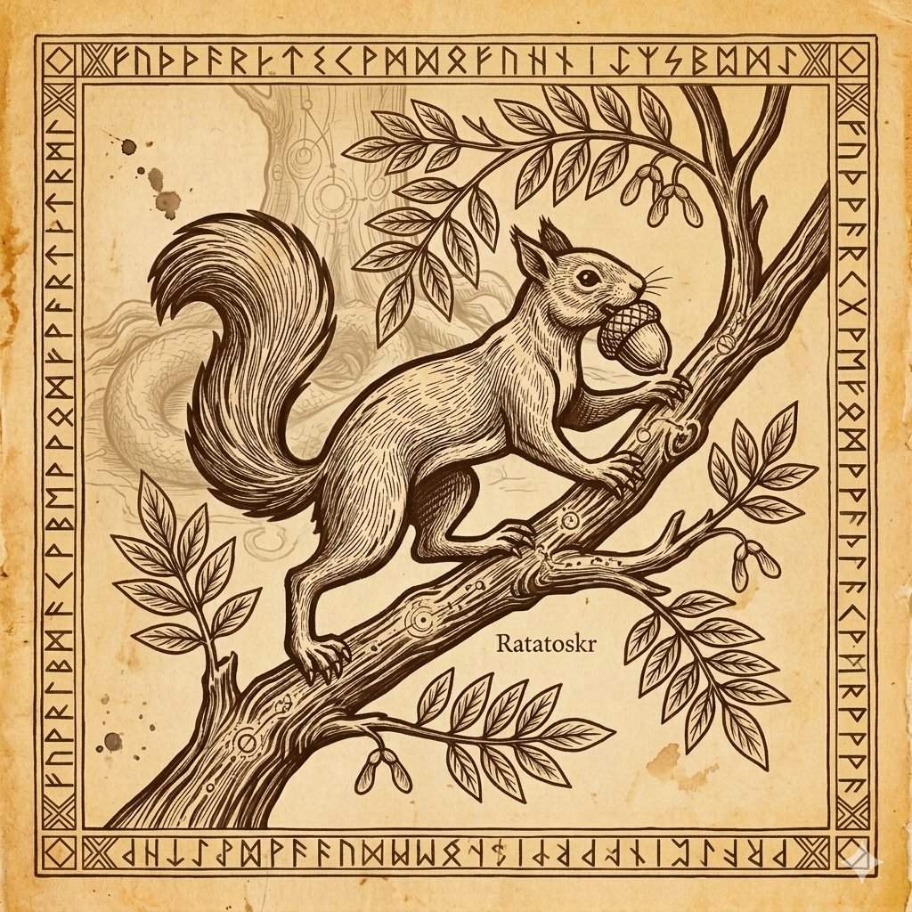

  

Ratatoskr Core (RATR)
=====================

  
  
  
  

> ⚠️ **Pre-launch. Mainnet goes live 2026-06-01 00:00 UTC.**
>
> The current release `v1.0.0-rc3` is a **release candidate** for the
> June 1 mainnet launch. It is suitable for pool operators and
> infrastructure partners pre-staging their setup, and for end-users
> who want to verify wallet UI / build process ahead of launch. The
> chain is not yet live; running the daemon now will simply idle at
> height 0 with no peers. The final `v1.0.0` release (with finalized
> chainparams and treasury address baked in) will be published before
> launch.

🌰 *The squirrel that runs the tree.* 🌳

Ratatoskr is a yespower Proof-of-Work cryptocurrency with deterministic
masternodes, a treasury fund for ecosystem development, and a native bridge
to Alephium. Part of the EnchantedForestDeFi ecosystem.

In Norse cosmology, **Ratatoskr** is the squirrel that runs up and down
**Yggdrasil**, the world tree, carrying messages between the eagle at the
crown and the serpent at the roots. The metaphor is the project: RATR is
the messenger layer between chains. The partner chain is **Alephium** —
phonetically cognate with **Alfheim**, one of the upper realms of
Yggdrasil. Each future bridge endpoint becomes another realm hanging from
the tree's branches.

Built on the Smartiecoin/Dash lineage, with the tokenomics rebalanced around
two lessons learned from prior MN coins: **miners must remain profitable for
the network to stay secure**, and **governance must be bounded so it cannot
extract value from the people securing the network**.

Quick links
-----------

| Resource | Link |
|---|---|
| 🌐 Website | <https://ratatoskr.enchantedforestdefi.com> |
| 💬 Discord | <https://discord.gg/SrffQVYqee> |
| 🔗 Block explorer | <https://ratrexplorer.enchantedforestdefi.com> *(testnet now, mainnet at T-0)* |
| 🌉 Bridge UI | <https://ratatoskrbridge.enchantedforestdefi.com> *(activates T+6h)* |
| 💼 Web wallet | <https://wallet.ratatoskr.enchantedforestdefi.com> *(network selector flips to mainnet at T-0)* |
| ⬇️ Latest release | <https://github.com/EnchantedForestDeFi/ratatoskr/releases/latest> |
| 📄 Whitepaper | [doc/whitepaper.md](doc/whitepaper.md) |
| ⛏️ Mining guide | [doc/mining.md](doc/mining.md) |
| 📅 Changelog | [CHANGELOG.md](CHANGELOG.md) |
| 🔒 Security policy | [SECURITY.md](SECURITY.md) |
| 🤝 Code of Conduct | [CODE_OF_CONDUCT.md](CODE_OF_CONDUCT.md) |
| ✉️ Contact | [releases@enchantedforestdefi.com](mailto:releases@enchantedforestdefi.com) |

Download
--------

Pre-built binaries for the current release candidate are available at:
**[github.com/EnchantedForestDeFi/ratatoskr/releases](https://github.com/EnchantedForestDeFi/ratatoskr/releases)**

| Platform | Tarball |
|---|---|
| Linux x86_64 | `ratatoskr-v1.0.0-rc3-linux-x86_64.tar.gz` |
| Windows x86_64 | `ratatoskr-v1.0.0-rc3-win64.tar.gz` |
| macOS | building post-launch (see [build-osx.md](doc/build-osx.md) to compile from source) |

Each release tarball contains six binaries: `ratatoskrd` (daemon), `ratatoskr-qt` (GUI wallet), `ratatoskr-cli`, `ratatoskr-tx`, `ratatoskr-util`, `ratatoskr-wallet`. Verify download integrity with the published `SHA256SUMS` file.

At a glance
-----------

| Parameter          | Value                                                  |
|--------------------|--------------------------------------------------------|
| Ticker             | RATR                                                   |
| Algorithm          | yespower (CPU mineable)                                |
| Block time         | 60 seconds                                             |
| Block reward       | 50 RATR (halving every 1,030,596 blocks, ~2 years)     |
| Max supply         | 100,000,000 RATR                                       |
| Reward split       | 60% miner / 30% masternode / 10% treasury              |
| Regular MN         | 7,500 RATR collateral, 1× voting weight                |
| EvoNode            | 30,000 RATR collateral, 4× voting weight               |
| Privacy            | CoinJoin, Tor v3                                       |
| Cross-chain        | Native bridge to Alephium (wRATR)                      |
| MN payments start  | Block 25,000 (~17 days after launch)                   |
| First superblock   | Block 30,000 (~21 days after launch)                   |
| Network port       | 9393                                                   |
| Address prefix     | Addresses start with `R`                               |

Reward split guardrails (v1.1)
------------------------------

Ratatoskr v1.0 ships with a fixed 60/30/10 reward split for launch stability.
A planned v1.1 hard fork (~2-3 months post-launch) will enable governance
proposals to adjust the miner/MN split, bounded by consensus-enforced rules
designed to prevent the extractive-vote failure mode that has killed other
MN coins:

- **Miner floor: 50%** — rejected at proposal submission if below
- **MN floor: 20%** — rejected at proposal submission if below
- **Treasury locked: 10%** — changeable only by hard fork
- **5 percentage point max shift per proposal** (gradualism)
- **90-day cooldown** between successful reward-split changes
- **60% supermajority** required to pass
- **Phased quorum**: 20% of active MNs at launch → 30% as network matures

MN collateral is also raise-only under governance (never lowerable),
grandfathered at registration (existing MNs always valid at the amount they
registered with), and capped at +50% per raise with a 90-day cooldown.

Treasury
--------

10% of every block subsidy flows as a continuous drip to the treasury
address, baked into consensus (no biweekly superblock gating, no governance
approval required for accrual — it's always funded, always on-chain).

**v1.0 launch: single-sig, air-gapped cold key.** Address published in the
release notes and signed with the treasury key before mainnet so anyone
can independently verify control.

**v1.1+ roadmap: 2-of-3 multisig.** Single-sig at v1.0 is a deliberate
scope limit — the 5 keys and hardware-wallet workflow for multisig are
treated as a follow-up, not a launch blocker.

Treasury purpose is primarily **Elexium gauge participation** — building
an EX lock ladder for voting + rebase rewards, seeding protocol-owned
liquidity in wRATR pools, and tactical bribes to direct emissions to
Ratatoskr-benefiting pools. Routine deployment is at operator discretion
within this scope at v1.0; broader spending requires a masternode vote
once governance activates at block 30,000.

License
-------

Ratatoskr Core is released under the terms of the MIT license. See
[COPYING](COPYING) for more information or see
https://opensource.org/licenses/MIT.

Upstream attribution
--------------------

Ratatoskr Core is a fork of [Smartiecoin Core](https://github.com/SmartiesCoin/Smartiecoin)
at v0.2.0, which is itself derived from Dash Core. We retain attribution
and copyright notices from upstream throughout the codebase.

Build / Compile from Source
---------------------------

The `./configure`, `make`, and `cmake` steps, as well as build dependencies,
are in [./doc/](/doc):

- **Linux**: [./doc/build-unix.md](/doc/build-unix.md)
  Ubuntu, Debian, Fedora, Arch, and others
- **macOS**: [./doc/build-osx.md](/doc/build-osx.md)
- **Windows**: [./doc/build-windows.md](/doc/build-windows.md)
- **OpenBSD**: [./doc/build-openbsd.md](/doc/build-openbsd.md)
- **FreeBSD**: [./doc/build-freebsd.md](/doc/build-freebsd.md)
- **NetBSD**: [./doc/build-netbsd.md](/doc/build-netbsd.md)

Binaries built: `ratatoskrd`, `ratatoskr-qt`, `ratatoskr-cli`, `ratatoskr-tx`,
`ratatoskr-util`, `ratatoskr-wallet`, `ratatoskr-node`.

Config file: `ratatoskr.conf`
Data directory: `%APPDATA%\RatatoskrCore` (Windows), `~/Library/Application Support/RatatoskrCore` (macOS), `~/.ratatoskrcore` (Linux).

Testing
-------

Testing and code review is the bottleneck for development. Please be patient
and help out by testing other people's pull requests, and remember this is a
security-critical project where any mistake might cost people money.

### Automated Testing

Developers are encouraged to write [unit tests](src/test/README.md) for new
code and submit new unit tests for old code. Compile and run with: `make check`.
Details: [/src/test/README.md](/src/test/README.md).

Regression and integration tests are in Python under [/test](/test) and can
be run with: `test/functional/test_runner.py`

Ecosystem
---------

Ratatoskr is one piece of the **EnchantedForestDeFi (EFD)** ecosystem. RATR is the messenger; the rest is what RATR moves between:

- **wRATR bridge** — Ratatoskr ↔ Alephium native lock-and-mint bridge for cross-chain liquidity. From wRATR-on-Alephium, the Alephium Bridge provides further hops to Ethereum and BSC (so we don't run separate EVM bridges)
- **Elexium gauge integration** — wRATR/ALPH and wRATR/NUTTY liquidity on Alephium's ve(3,3) DEX (Elexium). The treasury participates in gauge governance
- **EFD pool** — operator-run mining pool for RATR at launch ([stratum docs in doc/pool-operator-spec.md](doc/pool-operator-spec.md))
- **NUTTY** — Alephium-native memecoin in the EFD orbit (87% operator-held supply, separate from RATR)
- **Lore / community** — Norse mythology framing (Ratatoskr the messenger, Yggdrasil the tree, Alfheim = Alephium); Discord community at [discord.gg/SrffQVYqee](https://discord.gg/SrffQVYqee)

Contributing
------------

Contributions are welcome from anyone willing to put in the work. See [CONTRIBUTING.md](CONTRIBUTING.md) for the PR workflow, code style, and review process.

Security disclosures: please follow [SECURITY.md](SECURITY.md) — do not open public issues for vulnerabilities.

Community conduct: see [CODE_OF_CONDUCT.md](CODE_OF_CONDUCT.md).
